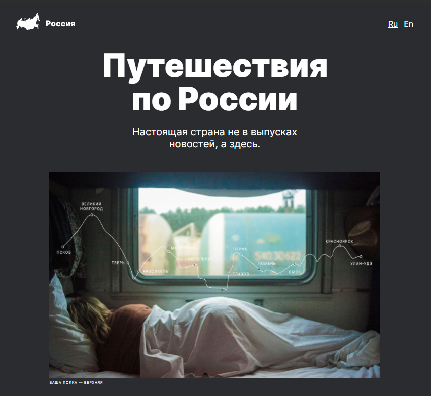

# Проектная работа 3: вёрстка адаптивного сайта [Путешествия по России](https://github.com/Petr-Glotov/russian-travel.git).

## Используемые технологии
▪️ HTML  
▪️ CSS  
▪️ Кроссбраузерная вёрстка  
▪️ Адаптивная вёрстка  
▪️ Grid  
▪️ Flex  
▪️ БЭМ (Nested)  
▪️ Git  

